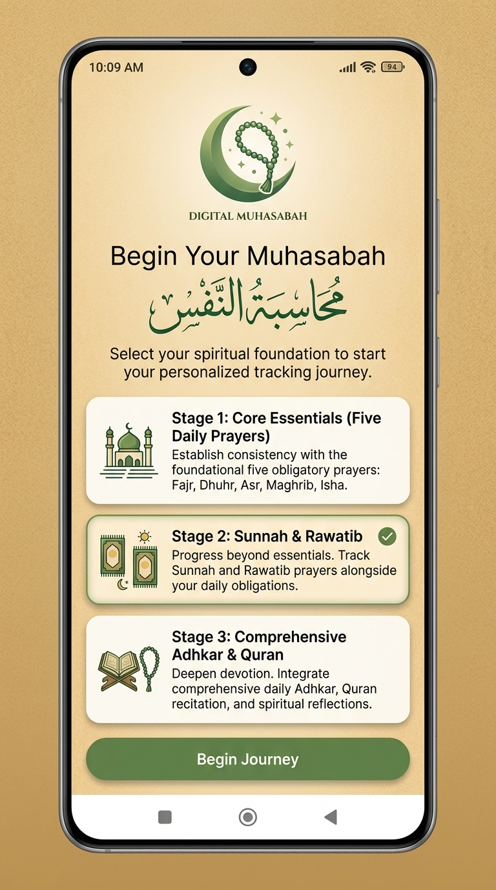
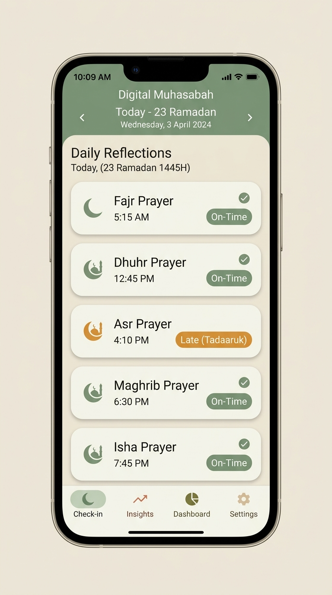
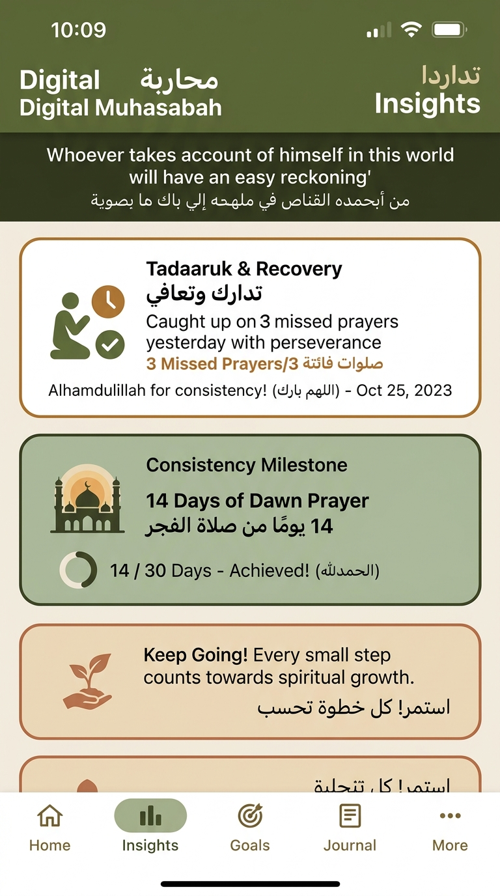
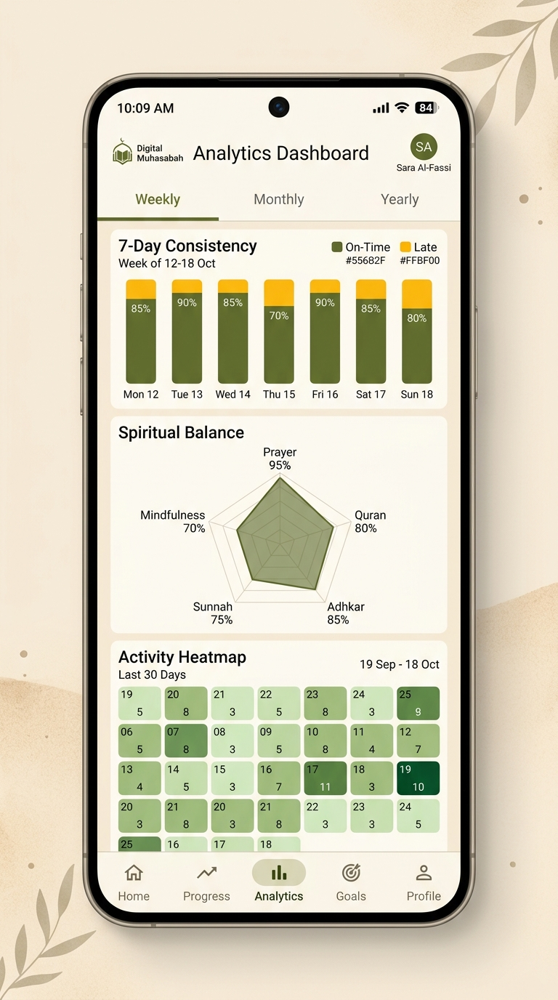
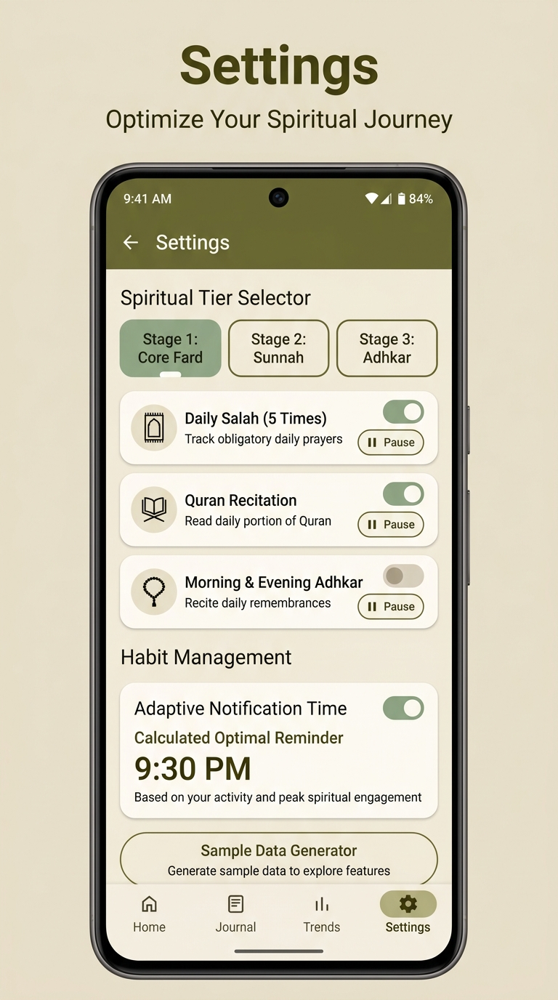

# Digital Muhasabah (محاسبة النفس)

> **A minimalist, private, local-first spiritual habit tracker and reflection companion built with Jetpack Compose & Kotlin.**

---

## 🌟 Overview & Philosophy

**Digital Muhasabah** is designed to facilitate mindful, consistent spiritual growth through the Islamic practice of *Muhasabah* (self-inventory and introspection).

Unlike conventional habit trackers that promote toxic productivity or high-stress streaks, Digital Muhasabah focuses on:
- **Tadaaruk (Make-Up) & Compassion**: Tri-state logging (`ON_TIME`, `LATE` / Tadaaruk, `MISSED`) rewards spiritual recovery and diligence rather than punishing delayed action.
- **Local-First & Zero Tracking**: 100% offline local database with Room. No tracking, no external analytics, no user accounts, and zero remote data harvesting.
- **Stage-Based Spiritual Progression**: Tiered habit sets (Stage 1: Core Fard, Stage 2: Sunnah Rawatib, Stage 3: Quran & Adhkar, plus Custom Habits).
- **Organic Earth-Tone M3 Design**: Soothing palette featuring Olive Green, Sage, Terracotta Gold, and Desert Sand, adhering to Material Design 3 and comprehensive Dark Theme support.

---

## 📸 App Tour & Feature Screenshots

| Onboarding (Spiritual Tiers) | Daily Check-in & Tri-State |
|:---:|:---:|
|  |  |
| *Select initial stage (Fard, Sunnah, Adhkar)* | *Tri-state logging (On-Time, Tadaaruk, Missed)* |

| Spiritual Insights & Milestones | Analytics & Radar Balance Wheel |
|:---:|:---:|
|  |  |
| *Non-judgmental recovery, streaks & wisdom* | *Radar balance wheel, weekly bars & 30-day heatmap* |

| Settings & Habit Management |
|:---:|
|  |
| *Custom habits, adaptive reminders & local privacy* |

---

## 📱 Core Features

### 1. Onboarding & Spiritual Tier Selection (`OnboardingScreen.kt`)


- **Step-by-Step Spiritual Journey**: Introduces the user to the foundational concept of *Nafs* accountability.
- **Stage 1 — Core Essentials (الأركان والفرائض)**: The 5 prescribed daily prayers (Fajr, Dhuhr, Asr, Maghrib, Isha).
- **Stage 2 — Sunnah & Rawatib (السنن الرواتب)**: Daily non-obligatory Sunnah prayers (Duha, Witr, Rawatib before/after Fard).
- **Stage 3 — Quran & Comprehensive Adhkar (القرآن والأذكار)**: Daily Quran recitation, morning & evening Adhkar, Astaghfirullah, and Salawat.

<br clear="right"/>

### 2. Daily Check-in & Tri-State Logging (`CheckinScreen.kt`)


- **Tri-State Status**:
  - `ON_TIME` (حاضر / أداء): Completed within its primary prescribed or planned time window.
  - `LATE` (قضاء / تدارك): Made up or completed later; acknowledged with positive encouragement and recovery value.
  - `MISSED` (فائت): Transparently noted without breaking positive momentum or punishing the user.
- **Reflective Daily Note**: An integrated local space for daily journaling, gratitude, and mindful introspection.
- **Dynamic Date Navigation**: Jump between days with previous/next controls and calendar pickers.

<br clear="right"/>

### 3. Spiritual Insights Engine (`InsightsScreen.kt` & `InsightsEngine.kt`)


- **Tadaaruk (Recovery) Recognition**: Praises catching up on missed prayers or duties with patience and determination.
- **Burnout & Strain Detection**: Identifies sharp drops in activity and surfaces soothing reminders on moderate, sustained deeds (*Ahabbu al-a'mali ila Allahi adwamuha wa in qall*).
- **Milestone Celebrations**: Uplifting indicators for 3, 7, 14, 30, and 40 continuous days of steadfastness.
- **Daily Hadith & Wisdom Banner**: Contextual Islamic quotes encouraging sincere intention (*Ikhlas*).

<br clear="right"/>

### 4. Spiritual Analytics Dashboard (`DashboardScreen.kt`)


- **7-Day Consistency & Breakdown**: Stacked visual indicators depicting On-Time vs. Late / Tadaaruk habits.
- **Category Radar Balance Wheel (`RadarBalanceWheel.kt`)**: Custom Jetpack Compose canvas drawing a 5-spoke polygon across:
  - *Prayer* (الصلاة)
  - *Quran* (القرآن)
  - *Remembrance* (الذكر)
  - *Sunnah* (السنن)
  - *Mindfulness & Self-discipline* (التزكية)
- **30-Day Spiritual Heatmap**: Calendar intensity grid displaying overall consistency.
- **Seasonal Reflections**: Dedicated tabs for high spiritual seasons (Ramadan, Dhul-Hijjah, Rajab/Sha'ban).

<br clear="right"/>

### 5. Settings, Adaptive Reminders & Privacy (`SettingsScreen.kt`)


- **Spiritual Stage Tuning**: Seamlessly promote or adjust active spiritual tiers at any point.
- **Custom Habit Builder**: Add personalized habits (e.g., Tahajjud, Charity, Fasting Mondays/Thursdays).
- **Pause & Resume**: Temporarily pause specific habits during travel, illness, or rest without resetting streak statistics.
- **Adaptive Notification Engine (`AdaptiveReminderEngine.kt`)**: Calculates when you typically reflect and suggests optimal times.
- **1-Click 35-Day Demo Data**: Quickly populate realistic historical data for testing and reviewing visual graphs.
- **Local-First Guarantee**: All data resides on the device Room database; zero network calls or tracking.

<br clear="right"/>

---

## 🏗 Architecture & Codebase Layout

The project adheres to clean **MVVM (Model-View-ViewModel)** and **Unidirectional Data Flow (UDF)**:

```
app/src/main/java/com/example/
├── data/
│   ├── local/
│   │   ├── AppDatabase.kt          # Room database definition with schema migrations
│   │   ├── HabitDao.kt             # Habit queries (active, tier-filtered, custom)
│   │   ├── HabitLogDao.kt          # Daily logs and date-range queries
│   │   └── UserSettingsDao.kt      # User preferences and spiritual tier persistence
│   ├── model/
│   │   ├── Models.kt               # Entity and domain models (HabitEntity, HabitLogEntity, etc.)
│   │   └── DefaultHabits.kt        # Predefined seeds for Stages 1, 2, and 3
│   └── repository/
│       └── MuhasabahRepository.kt  # Unified repository mediating database operations
├── domain/
│   └── engine/
│       ├── AdaptiveReminderEngine.kt # Computes adaptive reflection notification windows
│       ├── InsightsEngine.kt         # Evaluates streaks, recoveries, balance & alerts
│       ├── StatisticsEngine.kt       # Aggregates weekly, monthly, and yearly radar metrics
│       └── TimeUtils.kt              # Date manipulation & formatting helpers
├── ui/
│   ├── screens/
│   │   ├── checkin/                # Daily check-in screen, habit cards, custom habit dialog
│   │   ├── dashboard/              # Weekly, monthly deep-dive, yearly reflection & radar wheel
│   │   ├── insights/               # Daily insight cards, encouragement banners, milestone chips
│   │   ├── onboarding/             # Intro and spiritual tier onboarding selector
│   │   └── settings/               # Habit management, reminder settings, backup/reset
│   ├── theme/
│   │   ├── Color.kt                # Extended theme colors (Olive, Sage, Terracotta, Sand)
│   │   ├── Theme.kt                # MaterialTheme wrapper with Light/Dark extended colors
│   │   ├── Type.kt                 # Typography and Arabic font configurations
│   │   └── Dimens.kt               # Spacing, padding, and corner radius tokens
│   └── viewmodel/
│       └── MuhasabahViewModel.kt   # Central state holder with StateFlow & UI events
└── MainActivity.kt                 # Top-level scaffold, navigation bar, and screen routing
```

---

## 🛠 Tech Stack & Dependencies

- **Language**: Kotlin 2.2.10
- **UI Toolkit**: Jetpack Compose with Material 3 (Compose BOM `2024.09.00`)
- **Architecture**: Android Jetpack ViewModel, StateFlow, Coroutines
- **Local Persistence**: AndroidX Room 2.7.0 (with KSP)
- **Asynchronous Processing**: Kotlinx Coroutines
- **Build System**: Gradle Kotlin DSL (`build.gradle.kts`)
- **SDK Target**: Min SDK `24` (Android 7.0), Target SDK `36`

---

## 🚀 Getting Started for Contributors

### Prerequisites
1. **Android Studio**: Android Studio Ladybug / Meerkat or later.
2. **JDK**: Java 17 or Java 21 configured in Android Studio.
3. **Android SDK**: API 34+ installed.

### Setup & Build
1. Clone the repository:
   ```bash
   git clone <repository-url>
   cd <repository-directory>
   ```
2. Open the project in Android Studio.
3. Allow Gradle to sync dependencies.
4. Build the debug APK:
   ```bash
   gradle assembleDebug
   ```
5. Run on an Android device or emulator.

---

## 🧪 Testing & Verification

- **Compile verification**:
  ```bash
  gradle :app:compileDebugKotlin
  ```
- **Unit & JVM tests**:
  ```bash
  gradle :app:testDebugUnitTest
  ```
- **Roborazzi Screenshot Tests** (if updating UI components):
  ```bash
  gradle :app:verifyRoborazziDebug
  # Or to record updated baseline screenshots:
  gradle :app:recordRoborazziDebug
  ```

---

## 🤝 Contribution Guidelines

We welcome contributions! Please adhere to the following principles:

1. **Local-First & Privacy**:
   - Never add third-party tracking, analytics, crashlytics that send personal notes, or external cloud calls without explicit user consent and opt-in settings.
2. **Compassionate UX**:
   - Avoid aggressive notification tones or shaming text when prayers or habits are missed. The application's goal is encouragement and *tadaaruk* (recovery).
3. **Jetpack Compose Best Practices**:
   - Follow Material Design 3 tokens.
   - Use `MaterialTheme.colorScheme` and `MaterialTheme.extendedColors` instead of hardcoded hex values to maintain flawless dark mode support.
   - Ensure all touch targets meet or exceed 48dp (`Modifier.sizeIn(minWidth = 48.dp, minHeight = 48.dp)`).
   - Add clear `Modifier.testTag("...")` to interactive elements for test automation.
4. **State Management**:
   - Keep Composables stateless where possible; hoist state and actions into `MuhasabahViewModel.kt`.

---

## 📜 License

Distributed under the Apache 2.0 License or MIT License. See `LICENSE` for details.
